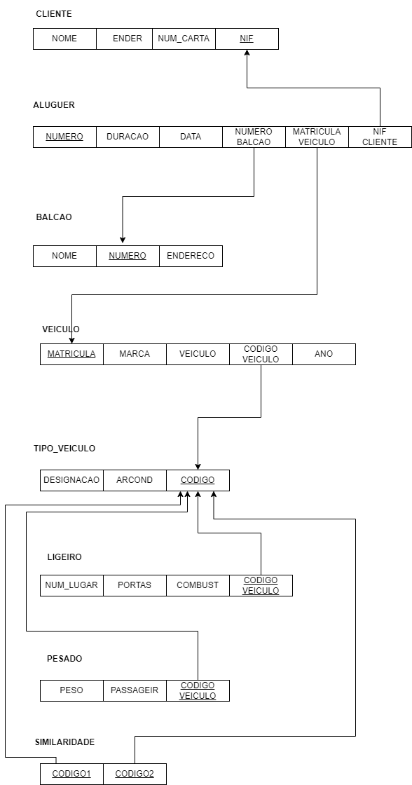

# BD: Guião 3


## ​Problema 3.1
 
### *a)*

```
Cliente: cliente(nome, endereço, num_carta, NIF)  
Aluguer: aluguer(número, duração, data, balcao_numero, cliente_NIF, veiculo_matricula)  
Balcão: balcao(nome, número, endereço)  
Veículo: veiculo(matrícula, marca, ano, tipo)  
Tipo_veículo: tipo_veiculo(designação, ar_condicionado, código)  
Similaridade: similaridade(codigo_a, codigo_b)  
Pesado: pesado(peso, passageiros, codigo_tipo)  
Ligeiro: ligeiro(numlugares, portas, combustivel, codigo_tipo)  
```


### *b)* 

```
Cliente:  
    Chaves candidatas:  
        - num_carta  
        - NIF  
    Chaves primárias:  
        - NIF  
    Chaves estrangeiras:  
        - não tem  
Aluguer:  
    Chaves candidatas:  
        - número  
    Chaves primárias:  
        - número  
    Chamadas estrangeiras:  
        - balcao_numero      
        - cliente_NIF  
        - veiculo_matricula    
Balcão:  
    Chaves candidatas:  
        - número  
    Chaves primárias:  
        - número  
    Chaves estrangeiras:  
        - não tem  
Veículo:  
    Chaves candidatas:  
        - matrícula
    Chaves primárias:  
        - matrícula  
    Chaves estrangeiras:  
        - tipo  
Tipo_Veiculo:  
    Chaves candidatas:  
        - código
    Chaves primárias:  
        - código  
    Chaves estrangeiras:    
        - não tem  
Similariedade:  
    Chaves candidatas:  
        - código_a  
        - código_b  
    Chaves primárias:  
        - código_a  
        - código_b 
    Chaves estrangeiras:  
        - Tipo_Veiculo_codigo 
        - Tipo_Veiculo_codigo 
Peasado:  
    Chaves candidatas:  
        - código_tipo    
    Chaves primárias:  
        _ código_tipo  
    Chaves estrangeiras:  
        - Tipo_Veiculo_codigo    
Ligeiro:  
    Chaves candidatas:  
        - código_tipo    
    Chaves primárias:  
        _ código_tipo  
    Chaves estrangeiras:  
        - Tipo_Veiculo_codigo  
```


### *c)* 




## ​Problema 3.2

### *a)*

```
Airport: airport(airport_code, city, state, name, arr_time, dep_time)  
Can_Land: can_land(airport_code, airplane_type)  
Airplane_type: airplane_type(type_name, max_seats, company)  
Airplane: airplane(airplane_id, total_no_of_seats, airplane_type)  
Flight_Leg: flight_leg(leg_no, sched_arr_time, sched_dep_time, flight_number)  
Leg_Instance: leg_instance(date, no_avail_seats, airplane_id, sched_arr_time, sched_dep_time, flight_number, leg_no)  
Flight: flight(number, airline, weekdays)  
Fare: fare(restrictions, amount, code, flight_number)
Seat: seat(seat_no, no_avail_seats, date, airplane_id, sched_arr_time, sched_dep_time, flight_number, leg_no)  
```


### *b)* 

```
Airport:  
    Chaves candidatas:  
        - airport_code  
    Chaves primárias:  
        _ airport_code  
    Chaves estrangeiras:  
        - não tem  
Can_Land:  
    Chaves candidatas:  
        - airport_code  
        - airport_type  
    Chaves primárias:  
        _ airport_code  
        - airport_type
    Chaves estrangeiras:  
        - airport_code  
        - airplane_type  
Airplane_type:  
    Chaves candidatas:  
        - airplane_type  
        - company  
    Chaves primárias:  
        _ airplane_type
    Chaves estrangeiras:  
        - naõ tem  
Airplane:  
    Chaves candidatas:  
        - airplane_type
        - airplane_id  
    Chaves primárias:  
        _ airplane_id  
    Chaves estrangeiras:  
        - airplane_type  
Flight_Leg:  
    Chaves candidatas:  
        - leg_no  
        - sched_arr_time  
        - sched_dep_time
        - flight_number
    Chaves primárias:  
        _ leg_no  
        - sched_arr_time  
        - sched_dep_time  
        - flight_number  
    Chaves estrangeiras:  
        - leg_no  
        - sched_arr_time  
        - sched_dep_time
        - flight_number
Leg_Instance:  
    Chaves candidatas:  
        - date  
        - airplane_id
        - sched_arr_time  
        - sched_dep_time
        - flight_number  
        - leg_no
    Chaves primárias:  
        - date  
        - airplane_id
        - sched_arr_time  
        - sched_dep_time
        - flight_number  
        - leg_no  
    Chaves estrangeiras:  
        - date  
        - sched_arr_time  
        - sched_dep_time
        - flight_number  
        - leg_no   
Flight:  
    Chaves candidatas:  
        - number  
    Chaves primárias:  
        _ number
    Chaves estrangeiras:  
        - não tem 
Fare:  
    Chaves candidatas:  
        - code  
        - flight_number
    Chaves primárias:  
        _ code  
        - flight_number  
    Chaves estrangeiras:  
        - flight_number
Seat:  
    Chaves candidatas:  
        - seat_no  
        - date  
        - airplnae_id
        - sched_arr_time  
        - sched_dep_time  
        - flight_number  
        - leg_no  
    Chaves primárias:  
        - seat_no  
        - date  
        - airplnae_id
        - sched_arr_time  
        - sched_dep_time  
        - flight_number  
        - leg_no    
    Chaves estrangeiras:  
        - date  
        - airplnae_id
        - sched_arr_time  
        - sched_dep_time  
        - flight_number  
        - leg_no
```


### *c)* 


## ​Problema 3.3


### *a)* 2.1


### *b)* 2.2


### *c)* 2.3


### *d)* 2.4

