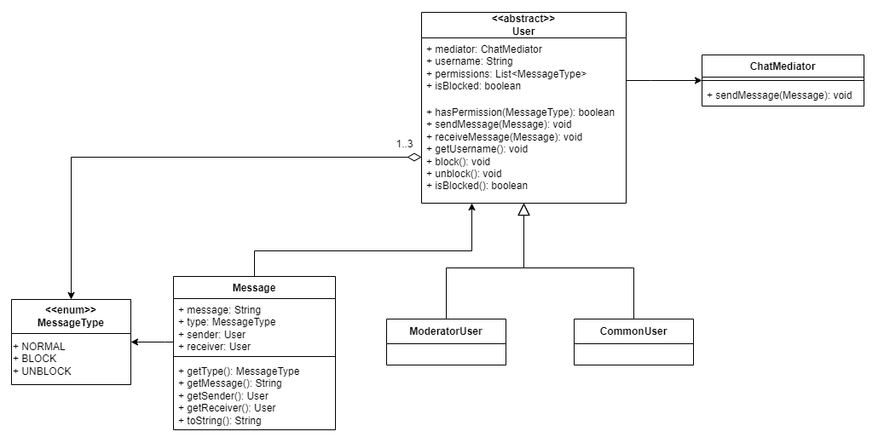

# Aula10 - X.3

## Autor: `Rafael Pinto, 103379, p5_09`

### 1) Problema

Num sistema de chat existem dois tipos de utilizador: comum e moderador. Cada tipo de utilizador tem diferentes permissões, por isso, é preciso garantir que cada utilizador só pode fazer o que lhe é permitido.  

Existem três tipos de mensagem: mensagem normais, mensagem para bloquear um utilizador e mensagem para desbloquear um utilizador. 

Os utilizadores comuns apenas podem enviar mensagens, enquanto que os moderadores podem enviar mensagens e bloquear/desbloquear utilizadores. Quando um utilizador é bloqueado, este deixa de poder enviar mensagens.

### 2) Solução

Utilizou-se um Mediator para gerir o fluxo de mensagens entre os utilizadores. Quando este recebe uma mensagem, verifica se o utilizador tem permissões para enviar essa mensagem, e se sim, envia-a, senão, envia uma mensagem de erro a informar que o utilizador não tem permissões para enviar esse tipo de mensagem. O Mediator verifica também se o utilizador está bloqueado, e se sim, não envia a mensagem.  

Criou-se uma classe abstrata User que representa um utilizador. Esta classe tem um método sendMessage que recebe uma mensagem e a envia para o Mediator. Tem também um método receiveMessage que recebe uma mensagem do Mediator.  

Criou-se uma classe concreta CommonUser que representa um utilizador comum. Esta classe apenas pode enviar mensagens normais.  

Criou-se uma classe concreta ModeratorUser que representa um utilizador moderador. Esta classe pode enviar mensagens normais, de bloqueio e de desbloqueio.  

Criou-se um enumerado MessageType que enumera os tipos de mensagem possíveis.  

Criou-se uma classe Message que representa uma mensagem.  

Diagrama de classes:

### 3) Referências

https://refactoring.guru/design-patterns/mediator  
https://www.javatpoint.com/mediator-pattern
